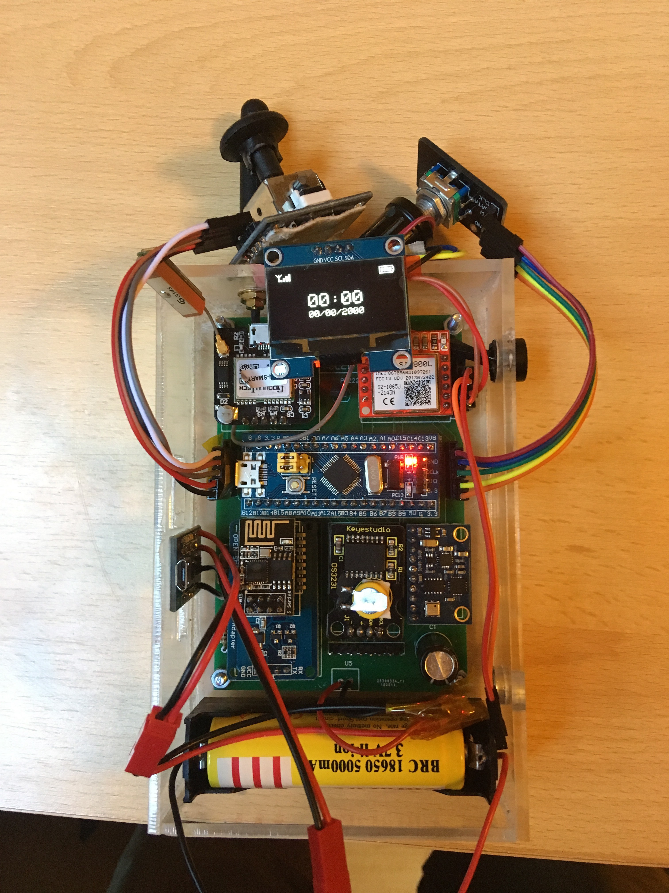
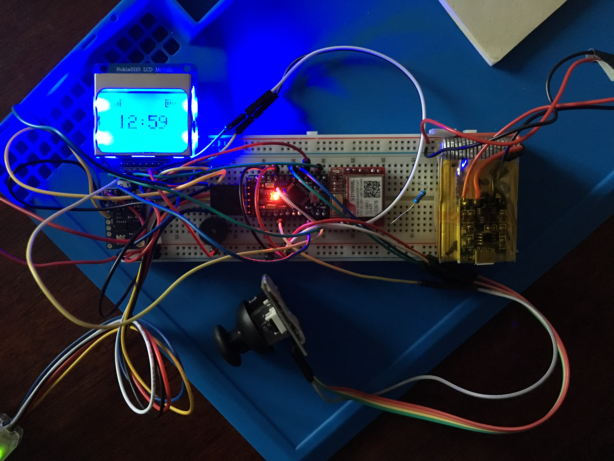

# smartphone
The smartphone of the future :

The project aims to be a very simple platform based on arduino, allowing to plug modules and display / manipulate things on a screen.
The system embeds a bunch of sensors, some inputs, an RTC clock, a GPS, and a GSM module, hence the idea of smartphone !

The project makes use of platformio to manage sdk download, project building, etc. See platformio.ini file. It can be debugged on stm32 platform, but not on arduino atmel.
The project has an internal configuration in the file src\hardware_config.h, where a bunch of defines help configure which modules are expected to be part of the hardware.

## Hardware v2

Hardware v2 is based on similar components as v1, except :
* Custom circuit board is now in place to link all the components together. See pcb-design\ for the gerber files used to produce the circuit board
* Arduino pro mini has been replaced by a stm32f103c8t6 (aka the bluepill). The main issue with arduino was a code size issue, where everything could not fit into 32kb of ram. The code has been ported to the bluepill using the maple framework.
* The screen has been replaced with a sh1106. This gives better resolution than the nokia, and simplifies the circuit board since it works in i2c instead of SPI for the PCD8544.

## PCB issues

The first iteration of the pcb design has a few issues which won't be fixed until a new batch of circuit boards is produced :
* there is a pin mismatch on the i2c bus, which uses PB8 and PB9 instead of PB6 and PB7. Both can be used hardware-wise, but the maple framework makes use of PB6/PB7 connections by default.
on 4.3.1 sdk, the following modification can be made to fix the issue :

in STM32F1/libraries/Wire/Wire.cpp :
//TwoWire Wire(1);
TwoWire Wire(1, 0x4);

this modification originates from file :
STM32F1/system/libmaple/stm32f1/include/series/i2c.h

/* Flag to use alternate pin mapping in i2c_master_enable(). */
#define _I2C_HAVE_DEPRECATED_I2C_REMAP 1
#define I2C_REMAP 0x4

* The spacing on the pinpad holes is too small
* The holes for the power wires are too small
* The transistor pads are too small
* The SIM800L slot misses the net pad

## Hardware v1

Hardware v1 was based on :
- Arduino pro mini 3,3V : that embeds the AtMega328P, running at 8mhz, and providing 32kB of progmem, 2kB of ram
- a PCD8544 screen (the same as the nokia 5110)
- GY-80 sensor board : provides temperature/atmospheric pressure, a digital compass, an accelerometer, a gyroscope
- DS3231 RTC module
- NEO6MV2 gps module
- Sim800l GPRS module

And for the inputs, a Playstation2 joystick, and a rotary encoder.

 
